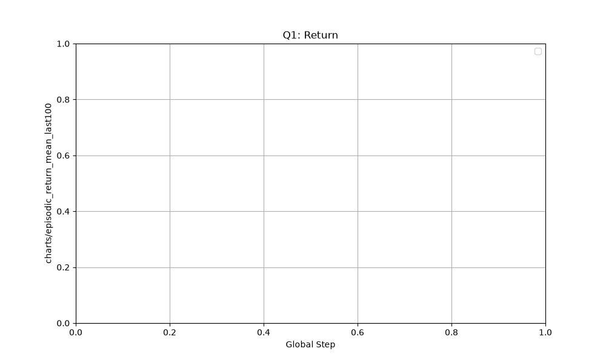
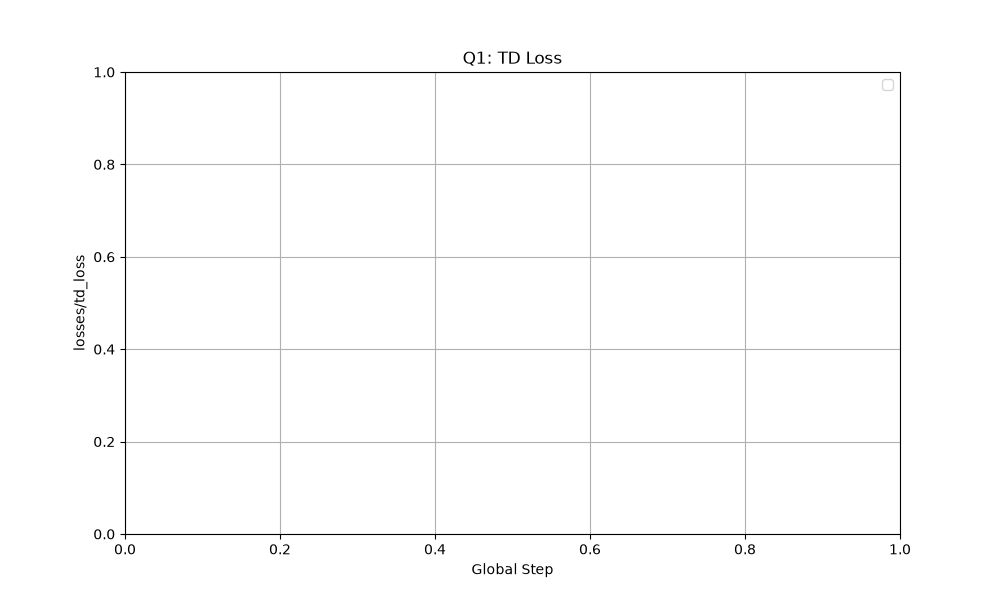
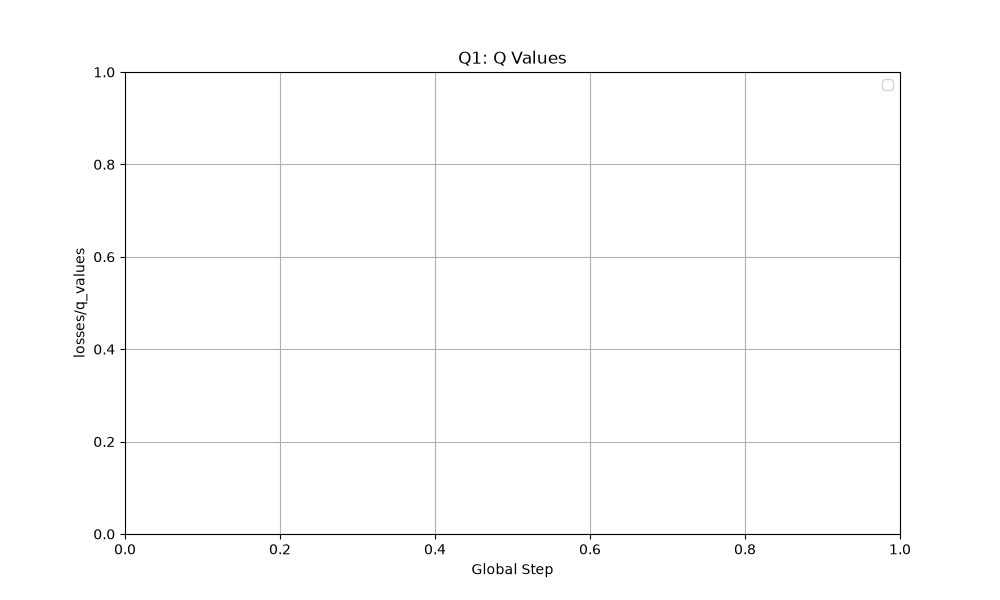
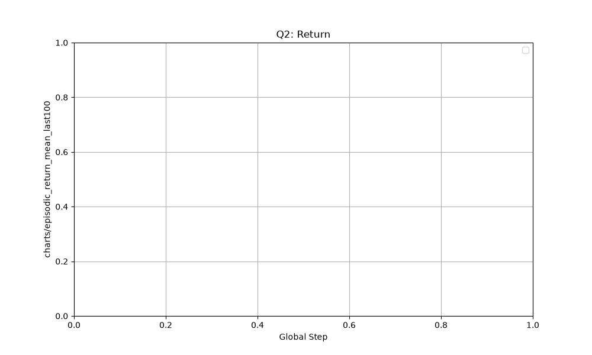
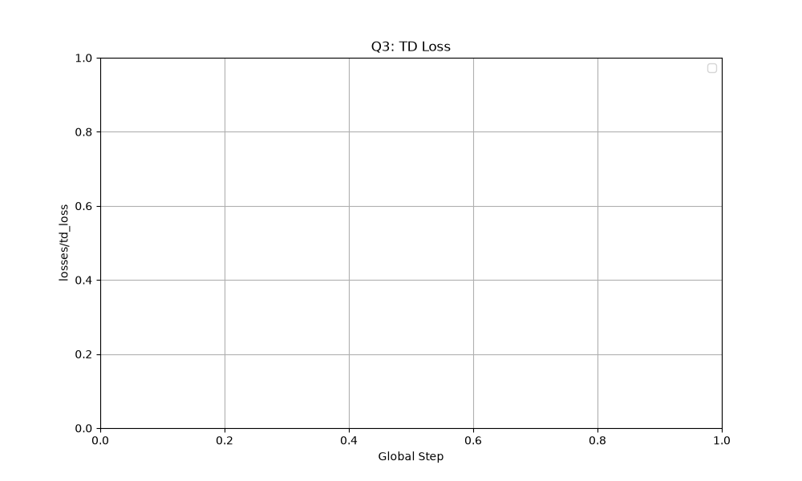

# Relatório: Deep Q-Networks (DQN)

**Nome:** Gabriel

Link para o fork do repositório contendo `algorithms/dqn.py` atualizado: *[Adicione seu link aqui]*

---

## Q1 — Frequência de sincronização da target network

**Previsão:**
Espero que uma frequência de `1` cause instabilidade e até divergência nos Q-values ao longo do tempo (devido ao problema do "alvo móvel"). Frequências maiores devem apresentar um aprendizado mais estável, mas uma frequência muito alta (ex: `5000`) deixará a convergência mais lenta.

**Varredura:**
Foram realizados testes com `dqn.target_network_frequency=1`, o baseline de `500` e uma frequência maior `5000`.

**Gráficos:**
- `charts/episodic_return_mean_last100`:
  
- `losses/td_loss`:
  
- `losses/q_values`:
  

**Explicação:**
O papel da **target network** é estabilizar o aprendizado no Q-learning. Quando calculamos o alvo de TD, estamos utilizando estimativas da própria rede para atualizar as estimativas futuras. Ao fixar o alvo por um certo período, evitamos uma dinâmica caótica e oscilações nos valores.
A curva de retorno episódico pode degradar mesmo quando o `td_loss` aparenta estar "bem". Isso ocorre porque o `td_loss` avalia apenas o erro de consistência de 1 passo entre a Q-network e a target network. Se as estimativas divergirem globalmente e ficarem incorretas (mas consistentes entre si de um passo pro outro), o erro será baixo, mas a política resultante da rede produzirá ações ruins no ambiente, reduzindo o retorno.
Observando `losses/q_values`, nota-se que, para a frequência extrema de 1, os valores de Q crescem descontroladamente (divergem), confirmando a previsão. A ausência da estabilidade fornecida pelo atraso no alvo causa um ciclo vicioso de superestimação durante o bootstrapping.

---

## Q2 — Tamanho do replay buffer

**Previsão:**
Espero que buffers muito pequenos (ex: `100` ou `500`) levem a um desempenho ruim e instável na curva de retorno. O baseline (`10000`) deve aprender o CartPole rapidamente sem problemas.

**Varredura:**
Foram testados `dqn.buffer_size=100`, `dqn.buffer_size=500` e o baseline `dqn.buffer_size=10000`.

**Gráficos:**
- `charts/episodic_return_mean_last100`:
  
- `losses/q_values`:
  

**Explicação:**
Ao utilizar um buffer muito pequeno, surgem dois problemas cruciais para a estabilidade da rede. Primeiro, a **correlação dos dados** do minibatch é extremamente alta. Como as transições vêm de amostras muito recentes e sequenciais, elas não são i.i.d., o que viola as premissas de otimização em deep learning, enviesando fortemente a rede para a região do espaço de estados recém-visitada. 
O segundo problema é o **esquecimento catastrófico (catastrophic forgetting)**. O buffer enche e sobrescreve as experiências antigas velozmente. Assim, a rede esquece comportamentos que já havia aprendido para certos estados, limitando a distribuição dos dados de treinamento e degradando severamente o retorno e os valores da Q-Network ao longo do tempo. Nossa previsão foi confirmada.

---

## Q3 — Taxa de Aprendizado (Learning Rate)

**Previsão:**
Espero que uma taxa muito alta (ex: `1e-2`) cause grandes oscilações e falha total no aprendizado do agente, visto que a rede daria passos de otimização muito agressivos. Uma taxa muito pequena (`1e-5`) impedirá a rápida convergência e precisará de mais passos de treinamento. O baseline (`2.5e-4`) deve ter o melhor e mais rápido desempenho.

**Varredura:**
Foram testados `dqn.learning_rate=1e-2`, `dqn.learning_rate=1e-5` e o baseline de `2.5e-4`.

**Gráficos (Justificativa de Escolha):**
A escolha por reportar `charts/episodic_return_mean_last100` é fundamental para avaliar se e com qual velocidade o agente resolve o ambiente. O gráfico `losses/td_loss` é necessário para identificar instabilidades severas e a magnitude dos erros causados pelo tamanho do passo na otimização.
- `charts/episodic_return_mean_last100`:
  
- `losses/td_loss`:
  

**Explicação:**
A taxa de aprendizado determina a magnitude do ajuste dos pesos da rede em cada atualização. O gráfico de retorno mostra que, com a taxa elevada de `1e-2`, o desempenho do agente fica instável ou sequer sai do chão. Observando o `td_loss`, os valores estouram devido a overshooting no gradiente, de modo que a rede não alcança um mínimo local adequado e suas predições ficam inutilizáveis, confirmando a instabilidade prevista. A taxa muito baixa (`1e-5`) sofre para subir a curva de retorno dentro do limite de timesteps do experimento. O baseline encontra o equilíbrio para treinar as features e as aproximações em tempo satisfatório.
